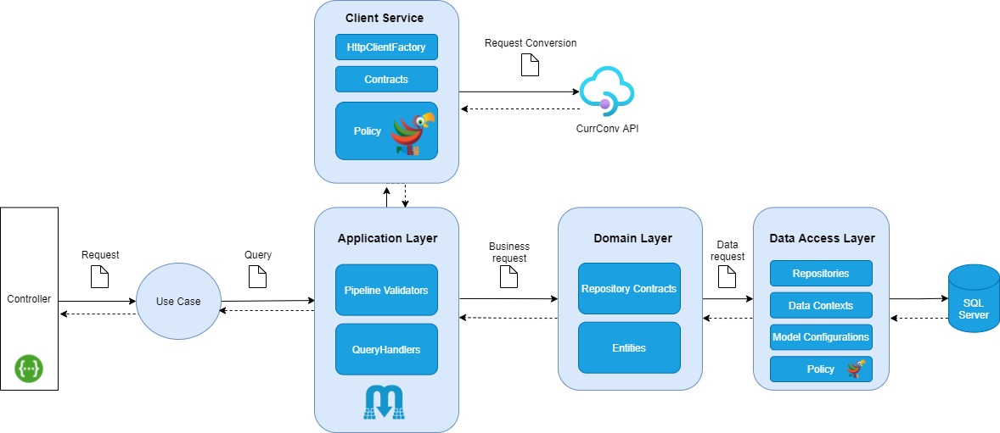

# ItauCoinExchange

Este projeto exemplica a implementação de uma aplicação que consome um serviço de conversão de moedas estrangeiras e fornece a cotação por segmento de negócio.
Construída em **.NET 5** sob um arquitetura hexagonal e aplicando os conceitos de **Domain-Driven Design**.

## Tecnologias

* [.NET 5](https://dotnet.microsoft.com/download/dotnet/5.0)
* [Entity Framework 5](https://docs.microsoft.com/pt-br/ef/core/what-is-new/ef-core-5.0/whatsnew)
* [Microsoft SQL Server on Linux for Docker](https://hub.docker.com/_/microsoft-mssql-server)
* [FluentValidation](https://fluentvalidation.net/)
* [Swagger](https://swagger.io/) - Documentação.
* [Mediatr](https://github.com/jbogard/MediatR)
* Polly

## WebServices

* [CurrConv API](https://www.currencyconverterapi.com/) - Conversão de moedas.

## Arquitetura

