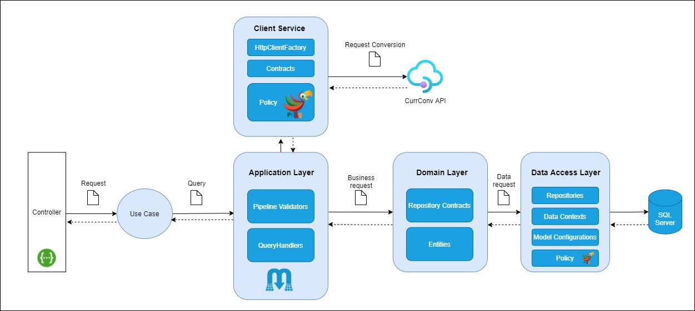

# ItauCoinExchange

Este projeto exemplica a implementação de uma aplicação que consome um serviço de conversão de moedas estrangeiras e fornece a cotação por segmento de negócio.
Construída em **.NET 5** sob um arquitetura hexagonal e aplicando os conceitos de **Domain-Driven Design**.


[](https://www.codefactor.io/repository/github/carlosdias7/itaucoinexchange)

## Tecnologias

* [.NET 5](https://dotnet.microsoft.com/download/dotnet/5.0)
* [Entity Framework 5](https://docs.microsoft.com/pt-br/ef/core/what-is-new/ef-core-5.0/whatsnew)
* [Microsoft SQL Server on Linux for Docker](https://hub.docker.com/_/microsoft-mssql-server)
* [FluentValidation](https://fluentvalidation.net/)
* [Swagger](https://swagger.io/) - Documentação.
* [Mediatr](https://github.com/jbogard/MediatR)
* Polly
* [Docker](https://www.docker.com/)

## WebServices

* [CurrConv API](https://www.currencyconverterapi.com/) - Conversão de moedas.

## Arquitetura



---

## Execução

Acesse o site [CurrConv API](https://www.currencyconverterapi.com/), crie uma conta e obtenha a chave de acesso para uso dos serviços disponíveis (se já possuir uma conta na plataforma, poderá ser utilizada)
Abra o arquivo *itaucoinexchange-api.env* e altere o valor da variável *CurrconvApiOptions__ApiKey* para a chave obtida.

Iniciar a aplicação

``` bash
docker-compose -f docker-compose.itau-coin-exchange.yml up --build
```

O arquivo *docker-compose.itau-coin-exchange.yml* configura o container para a aplicação e para o banco de dados SQL Server.

Acesse https://localhost:5000/swagger/index.html para abrir a especificação da API.

## Endpoints

### GET https://localhost:5000/api/v1/segments
Retorna todos os segmentos cadastrados.

<details><summary>Response</summary><p>
  
``` json 
{
  "Success": true,
  "Data": [
    {
      "Id": "1568974",
      "Name": "Private",
      "ExchangeRate": 0.1
    },
    {
      "Id": "658568",
      "Name": "Varejo",
      "ExchangeRate": 0.25
    },
    {
      "Id": "6653178864",
      "Name": "Segmento Personnalite",
      "ExchangeRate": 0.36
    }
  ],
  "Messages": []
}
```
</p></details>

### PUT https://localhost:5000/api/v1/segments/exchange-rate
Atualiza a taxa de câmbio do segmento selecionado.

<details><summary>Response</summary><p>
  
``` json 
{
  "Success": true,
  "Data": 
  {
      "Id": "6653178864",
      "Name": "Segmento Personnalite",
      "ExchangeRate": 0.36
   },
  "Messages": []
}
```
</p></details>

### GET https://localhost:5000/api/v1/coins/convertions/segment
Consulta a conversão de um montante para Real(BRL).

<details><summary>Response</summary><p>
  
``` json 
{
  "Success": true,
  "Data": 
  {
      "SegmentId": "6653178864",
      "SegmentName": "Segmento Personnalite",
      "CoinFrom": "USD",
      "Amount": 10.00,
      "CoinTo": BRL,
      "ConvertedAmount": 54.67
   },
  "Messages": []
}
```
</p></details>

## Autor
[Carlos Dias](https://github.com/CarlosDias7)

